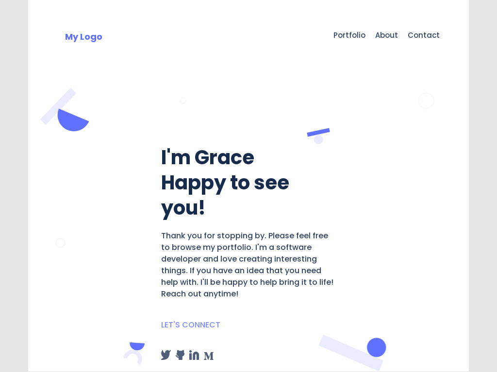

Grace's Portfolio

This project aims to show my soft skills as well as my technical skill-sets

## Built With

- HTML
- CSS
- Github

## Live Demo

[Live Demo Link](https://gracekabaghe.github.io/portfolio/)

## Getting Started

To get a local copy up and running follow these simple example steps.

### Install

- Clone this repo git@github.com:gracekabaghe/portfolio.git
- Navigate to atform branch
- Open the folder in your code editor

## Authors

👤 **Grace Kabaghe**

- GitHub: [@githubhandle](https://github.com/gracekabaghe)

## 🤝 Contributing

Contributions, issues, and feature requests are welcome!

Feel free to check the [issues page](../../issues/).

## Show your support

Give a ⭐️ if you like this project!

## Acknowledgments

- Hat tip to anyone whose code was used
- Inspiration
- etc

## 📝 License

This project is [MIT](./MIT.md) licensed.